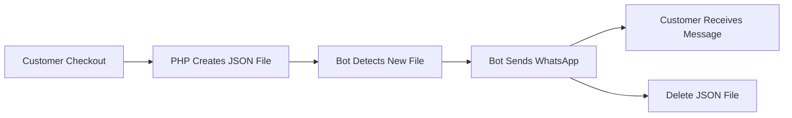

# 🌙 Poshy Lifestyle - FREE WhatsApp Bot Setup Guide

## 🎯 Overview
This is a **COMPLETELY FREE** WhatsApp automation solution using `whatsapp-web.js`. No Twilio, no Cloud API, no monthly costs!

### ✨ Features
- ✅ **FREE** - No API costs
- ✅ **Automatic** - Sends order confirmations instantly
- ✅ **Persistent** - Runs 24/7 with PM2
- ✅ **Ramadan Theme** - Beautiful Arabic messages
- ✅ **No Code Changes** - Works with your existing checkout

---

## 📋 Prerequisites

- Fedora Linux (or any Linux with Node.js support)
- Root/sudo access
- WhatsApp account
- Your smartphone nearby (for QR code scanning)

---

## 🚀 Quick Setup (5 Minutes)

### Step 1: Run the Setup Script

```bash
cd /var/www/html/poshy_store/whatsapp_bot
sudo bash setup_whatsapp.sh
```

This will:
- Install Node.js and npm
- Install PM2 process manager
- Install bot dependencies
- Create necessary directories
- Start the WhatsApp bot

### Step 2: Connect WhatsApp (IMPORTANT!)

View the QR code:
```bash
pm2 logs poshy-whatsapp
```

You'll see something like this:
```
========================================
🌙 POSHY LIFESTYLE - WhatsApp Bot
========================================

📱 Scan this QR code with WhatsApp:
   1. Open WhatsApp on your phone
   2. Go to Settings > Linked Devices
   3. Tap "Link a Device"
   4. Scan the QR code below:

████ ▄▄▄▄▄ █▀█ █▄▀▀▀▄█ ▄▄▄▄▄ ████
████ █   █ █▀▀▀█ ▀ ▀▀█ █   █ ████
...
```

**Scan this QR code with your WhatsApp!**

### Step 3: Wait for Connection

Once scanned, you'll see:
```
✅ WhatsApp Bot is READY and connected!
🚀 Monitoring for order confirmations...
```

**Done! Your bot is now running 24/7!**

---

## 📱 How It Works



### Technical Flow:

1. **Customer places order** → PHP checkout.php runs
2. **PHP creates JSON file** → `/var/www/html/poshy_store/pending_sms/order_123_xxx.json`
3. **Node.js bot detects file** → Chokidar watches the folder
4. **Bot reads JSON** → Extracts phone & message
5. **WhatsApp message sent** → via whatsapp-web.js
6. **File deleted** → Cleanup after success

---

## 🔧 Useful Commands

### Check Bot Status
```bash
pm2 status                    # Show all PM2 processes
pm2 logs poshy-whatsapp       # View live logs
pm2 monit                     # Real-time monitoring dashboard
```

### Control Bot
```bash
pm2 restart poshy-whatsapp    # Restart bot
pm2 stop poshy-whatsapp       # Stop bot
pm2 start poshy-whatsapp      # Start bot
pm2 delete poshy-whatsapp     # Remove bot from PM2
```

### View Logs
```bash
# WhatsApp bot log
tail -f /var/www/html/poshy_store/whatsapp_bot/bot.log

# PM2 error log
pm2 logs poshy-whatsapp --err

# Check pending messages
ls -la /var/www/html/poshy_store/pending_sms/
```

---

## 📝 Message Example

When a customer places an order, they receive:

```
🌙 ═══ Poshy Lifestyle ═══ 🌙

مساء الخير والبركة 🌙
رمضان كريم من عائلة بوشي 💜

✅ تم تأكيد طلبك بنجاح!

━━━━━━━━━━━━━━━━━━━━
📦 تفاصيل الطلب:
• رقم الطلب: #157
• العميل: أحمد محمد
• المبلغ الإجمالي: 125.500 JOD

🛍️ المنتجات:
   1. عطر فاخر × 1
   2. كريم ترطيب × 2

━━━━━━━━━━━━━━━━━━━━
🎁 مكافأة النقاط:
لقد حصلت على 377 نقطة من هذا الطلب! 🎉
يمكنك تحويلها لرصيد محفظتك

📋 الحالة: قيد المعالجة

🚚 سيتم التواصل معك قريباً لتأكيد موعد التوصيل

━━━━━━━━━━━━━━━━━━━━
📞 للاستفسار:
• واتساب: رد على هذه الرسالة
• الموقع: www.poshystore.com

✨ تقبل الله صيامكم وقيامكم ✨
🌙 رمضان كريم 🌙

مع حبنا،
فريق Poshy Lifestyle 💜
```

---

## 🔥 Testing the Bot

### Manual Test
Create a test file to send yourself a message:

```bash
cat > /var/www/html/poshy_store/pending_sms/test.json << 'EOF'
{
  "phone": "+962791234567",
  "message": "🧪 Test message from Poshy Lifestyle!\n\nIf you received this, the bot is working perfectly! ✅",
  "timestamp": "2026-02-14 20:00:00",
  "type": "test"
}
EOF
```

Watch the logs:
```bash
pm2 logs poshy-whatsapp
```

You should see:
```
📤 Sending message to: 962791234567
✅ Message sent successfully to 962791234567
```

### Test from PHP
Create a test script:

```php
<?php
require_once '/var/www/html/poshy_store/includes/whatsapp_functions.php';

sendWhatsAppMessage(
    '+962791234567',  // Your phone number
    "🧪 PHP Test\n\nBot integration working! ✅"
);

echo "Test message queued!\n";
?>
```

---

## 🛠️ Troubleshooting

### Issue: Bot not sending messages

**Check 1: Is bot running?**
```bash
pm2 status
# Should show "poshy-whatsapp" as "online"
```

**Check 2: Is WhatsApp connected?**
```bash
pm2 logs poshy-whatsapp --lines 50
# Look for "✅ WhatsApp Bot is READY"
```

**Check 3: Are files being created?**
```bash
ls -la /var/www/html/poshy_store/pending_sms/
# Should show .json files briefly before deletion
```

**Check 4: File permissions?**
```bash
sudo chown -R apache:apache /var/www/html/poshy_store/pending_sms/
sudo chmod 755 /var/www/html/poshy_store/pending_sms/
```

### Issue: WhatsApp disconnected

Re-scan QR code:
```bash
pm2 restart poshy-whatsapp
pm2 logs poshy-whatsapp
# Scan the new QR code
```

### Issue: Phone number format

The bot auto-formats Jordan numbers:
- `0791234567` → `962791234567`
- `791234567` → `962791234567`
- `+962791234567` → `962791234567`

For other countries, update bot.js line 118-121.

---

## 🔐 Security Notes

1. **WhatsApp Session**: Stored in `/var/www/html/poshy_store/whatsapp_bot/.wwebjs_auth/`
   - Keep this secure!
   - If deleted, you'll need to re-scan QR

2. **Pending Files**: Automatically deleted after sending
   - Failed messages moved to `/pending_sms/errors/`

3. **Logs**: Contain phone numbers and messages
   - Rotate logs regularly:
   ```bash
   pm2 install pm2-logrotate
   ```

---

## 🎨 Customization

### Change Message Template

Edit: `/var/www/html/poshy_store/includes/whatsapp_functions.php`

Find `buildOrderConfirmationMessage()` function and customize:
- Greeting messages
- Emojis
- Contact information
- Message structure

### Change Phone Number Format

Edit: `/var/www/html/poshy_store/whatsapp_bot/bot.js`

Lines 118-125 - Adjust country code:
```javascript
// For different country (e.g., Saudi Arabia +966)
if (!phoneNumber.startsWith('966') && phoneNumber.length === 10) {
    phoneNumber = '966' + phoneNumber.substring(1);
}
```

---

## 📊 Monitoring

### View Statistics

```bash
# Messages sent today
pm2 logs poshy-whatsapp | grep "✅ Message sent" | wc -l

# Failed messages
ls /var/www/html/poshy_store/pending_sms/errors/ | wc -l

# Bot uptime
pm2 info poshy-whatsapp
```

### Set Up Alerts

Get notified if bot crashes:
```bash
pm2 install pm2-slack
pm2 set pm2-slack:slack_url https://hooks.slack.com/YOUR_WEBHOOK
```

---

## 🌐 Auto-Start on Boot

Already configured! The bot will automatically start when server reboots.

To verify:
```bash
systemctl status pm2-root
# Should show as "active (exited)"
```

---

## 💡 Advanced Features

### Send Custom Messages

```php
// In any PHP file
require_once '/var/www/html/poshy_store/includes/whatsapp_functions.php';

sendWhatsAppMessage(
    '+962791234567',
    "Custom message here!"
);
```

### Bulk Messages

```php
$customers = [
    '+962791234567',
    '+962787654321',
    // ...
];

foreach ($customers as $phone) {
    sendWhatsAppMessage($phone, "Special Ramadan offer! 🌙");
}
```

---

## ❓ FAQ

**Q: Does this cost money?**  
A: No! Completely free. Uses your WhatsApp account.

**Q: How many messages can I send?**  
A: WhatsApp limits apply (don't spam). For legit orders, no problem.

**Q: Can I use WhatsApp on my phone while bot is running?**  
A: Yes! It's a linked device, like WhatsApp Web.

**Q: What if my phone dies?**  
A: Bot stays connected. Your phone just needs to be online when scanning QR initially.

**Q: Can I see sent messages on my phone?**  
A: Yes! All messages appear in your WhatsApp like you sent them manually.

---

## 🆘 Support

If you need help:

1. Check logs: `pm2 logs poshy-whatsapp`
2. Check bot log: `tail -f /var/www/html/poshy_store/whatsapp_bot/bot.log`
3. Restart bot: `pm2 restart poshy-whatsapp`
4. Re-scan QR: Check "Troubleshooting" section above

---

## 📜 License

Free to use for Poshy Lifestyle E-Commerce Platform

---

**🌙 Ramadan Kareem! May your store thrive! 💜**
